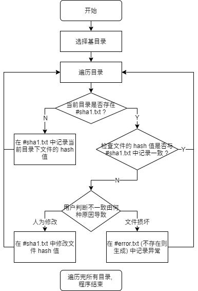

# Check Hash

批量检查文件 hash 值的小工具, 每次运行程序可以快速找出发生损坏（变化）的文件.  

运行需要 python 环境.  

运行程序后需要用户先选择一个基目录, 程序会深度优先遍历基目录, 在每个文件夹下生成记录 hash 值的文件. 

## 使用说明

> 如果路径中含有反斜杠 `\` , 注意避免产生转义字符.

* 运行程序需要使用参数 `-r` 或 `--run` 指定目录路径, 可以一次性指定任意数量的目录, 比如   
`python checkSHA1.py -r D:\\test1 D:\\test2`  
程序运行的逻辑见流程图. 
* 如果要删除程序产生的记录文件, 使用参数 `-c` 或 `--clean` 指定目录路径, 可以一次性指定任意数量的目录. 程序会递归删除目录下所有 "#sha1.txt" 和 "#error.txt", 此操作不能撤回.  
* 如果要忽略某个文件夹及其所有子文件夹, 在此文件夹下新建一个名为 "#ignore" 的文件, 程序会自动忽略.  

## 程序逻辑

 

"#sha1.txt" 中记录当前目录下所有文件的 hash 值.  
"#error.txt" 中记录 hash 值发生变化的文件.